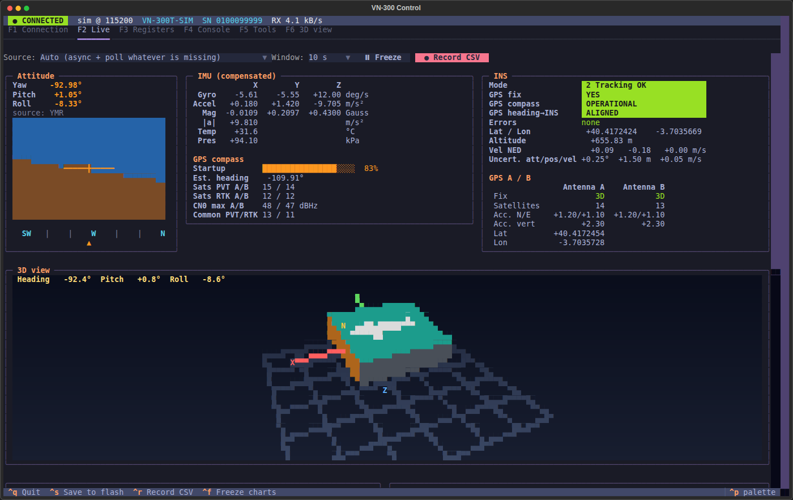
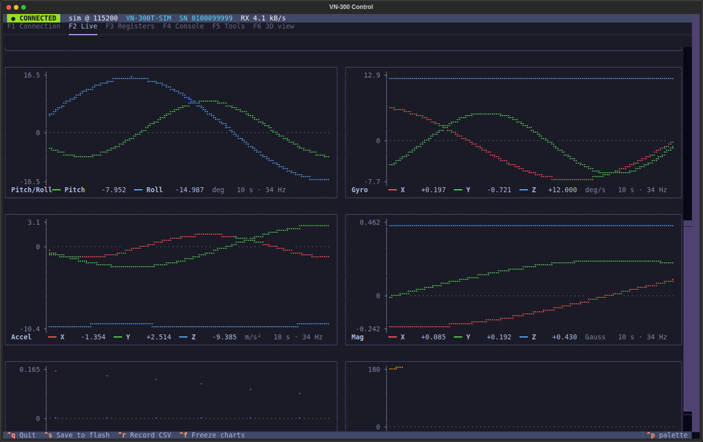
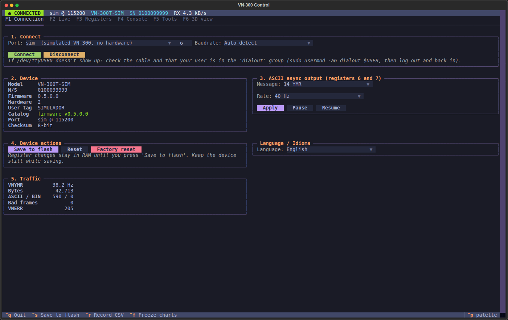
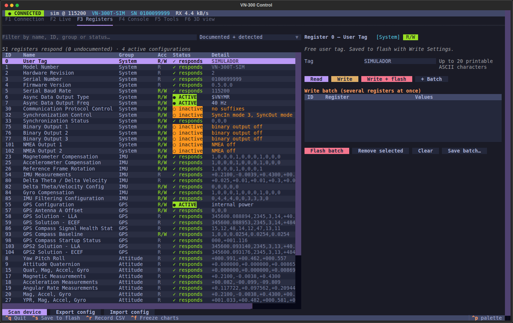
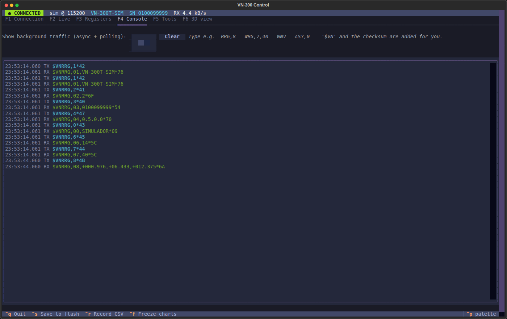
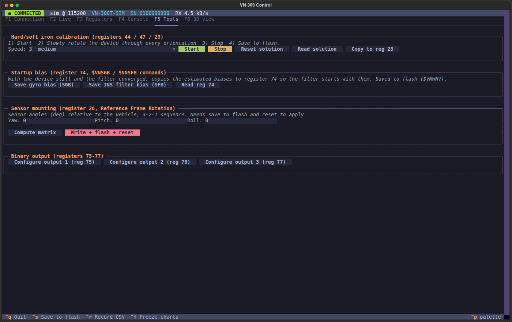
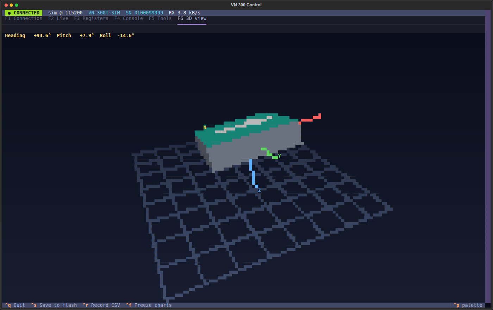

# vn300ctl — VN-300 Control for Linux

[Español](README.es.md) · **English**

Terminal application for the **VectorNav VN-300**, inspired by VectorNav Control Center:
live view, 3D attitude view, register reading and writing, and flashing one or several registers.
All configuration follows the **UM005 manual for firmware v0.5.0.0 (Document Revision 2.22)**:
the 51 registers it documents, their fields and options, the commands (`$VNRRG/$VNWRG/$VNWNV/$VNRFS/
$VNRST/$VNASY/$VNBOM/$VNSGB/$VNSFB`), 8-bit checksum or CRC16, and the `0xFA` binary output.
If the device runs other firmware, the app warns you when connecting. IDs that respond but are not in
that manual show up as "undocumented" (raw read and write).

The interface, the command line and `vn300.sh` work in **English and Spanish** (see [Language](#language)).

## Getting started

```bash
./vn300                          # opens the interface; choose the port in F1
./vn300 -p /dev/ttyUSB0          # connects straight away (baudrate auto-detected)
./vn300 -p sim                   # simulator, to try it without the device
./vn300 --lang es                # interface in Spanish (or VN300_LANG=es)
```

The first time, `./vn300` creates `.venv/` and installs `textual` and `pyserial`.
If you don't have permission on the port: `sudo usermod -aG dialout $USER`, then log out and back in.

## Screenshots

Taken with the built-in simulator (`./vn300 -p sim`), no hardware connected.

**F2 Live**: attitude, IMU, INS, GPS A/B and the 3D view



**F2 Live**: charts (Pitch/Roll, Gyro, Accel, Mag, Velocity, Yaw)



| | |
|---|---|
|  **F1 Connection** |  **F3 Registers** |
|  **F4 Console** |  **F5 Tools** |

**F6 3D view**



## Interface (keys F1–F6)

| Tab | What it does |
|---|---|
| **F1 Connection** | Port, baudrate (auto), device info, ASCII async output (reg 6/7), pause/resume, save to flash, reset and factory reset. **Language** selector |
| **F2 Live** | Attitude (horizon, heading tape and **3D view**), IMU, INS status, GPS A/B, GPS compass. High-resolution braille charts (Pitch/Roll, Yaw, Gyro, Accel, Mag, Velocity) with a 2–60 s window and freeze (Ctrl+F). Reads the ASCII or binary stream the device already outputs (if it only sends a quaternion, YPR is computed) and polls whatever is missing. **Record CSV** (Ctrl+R) to `~/vn300_logs/` |
| **F3 Registers** | Scans all 256 IDs on connect: **Status** column (● ACTIVE / ○ inactive / ✓ responds / ✕ missing) with detail (e.g. binary output at 100 Hz, velocity aiding active). Filter: documented + detected, responding only, active only, all. Per-field form, **Read**, **Write** (RAM), **Write + flash**, **+ Batch** to flash several, JSON export/import (`~/vn300_configs/`). Undocumented registers can be read and written raw |
| **F4 Console** | ASCII terminal: type `RRG,8` or `WRG,7,40`; `$VN` and the checksum are added for you. `VNERR` errors are explained |
| **F5 Tools** | Hard/soft iron calibration (reg 44/47 → 23), startup bias with `$VNSGB`/`$VNSFB` (→ reg 74), mounting matrix from yaw/pitch/roll (reg 26) and a binary output wizard (reg 75–77) with checkboxes |
| **F6 3D view** | Full-screen 3D VN-300 turning with yaw/pitch/roll in real time: the box with its front face (+X) in orange, a forward arrow, the body X/Y/Z axes and an NED floor with North marked. Drag with the mouse to orbit the camera, wheel to zoom, double-click to reset (or arrow keys, `+`/`-` and `r`) |

`Ctrl+S` saves to flash (`$VNWNV`); `Ctrl+Q` quits.

**Writing and flashing are not the same:** *Write* changes the register in RAM, and the change is lost
on restart. *Flash* also runs `$VNWNV`, which saves **all** registers to non-volatile memory.
Keep the device still while it saves.

## Language

The interface, the command line and `vn300.sh` work in Spanish and English. The language is chosen in
this order of priority: `--lang es|en`, the `VN300_LANG` variable, the F1 selector (remembered in
`~/.config/vn300ctl/settings.json`) and, if none is set, the system language. Changing it in F1 restarts
the interface and reconnects to the same port.

## Script with modes: `vn300.sh`

```bash
./vn300.sh                       # interactive menu
./vn300.sh help                  # every mode
./vn300.sh ui | sim | monitor | info | read 8 63 | write 6 14 -- 7 40 --flash
./vn300.sh output ymr 50 --flash | backup | restore | log 60 | doctor | latency
```

The Spanish mode names work too (`ayuda`, `leer`, `escribir`, `salida`, `respaldo`, `restaurar`, `grabar`, `latencia`).
`doctor` checks permissions, ModemManager and the FTDI `latency_timer`; `latency` sets it to 1 ms (sudo).
Default port: `VN300_PORT` or the FTDI in `/dev/serial/by-id`.

## Registers 50/51 (velocity aiding)

They are not in the firmware v0.5.0.0 manual, so the app does not define them: if the device answers
them, they show up in F3 as "undocumented" and can be read or written raw. In the VN-100 manuals they are
*Velocity Compensation Measurement* (50) and *Control* (51), and they only compensate the centripetal
acceleration of the attitude filter. They are not an odometry input for the INS.

## Command line (for scripts)

```bash
./vn300 ports
./vn300 -p /dev/ttyUSB0 info
./vn300 -p /dev/ttyUSB0 read 8 63 98
./vn300 -p /dev/ttyUSB0 write 7 40                       # one register, RAM only
./vn300 -p /dev/ttyUSB0 write 6 14 -- 7 40 --flash       # several + save to flash
./vn300 -p /dev/ttyUSB0 write 57 0.12 0 -0.30 --flash -y # no confirmation
./vn300 -p /dev/ttyUSB0 dump -o my_config.json           # configuration backup
./vn300 -p /dev/ttyUSB0 flash my_config.json             # restore or clone the configuration
./vn300 -p /dev/ttyUSB0 monitor                          # attitude and INS as plain text
./vn300 -p /dev/ttyUSB0 cmd "RRG,5"
./vn300 -p /dev/ttyUSB0 save | reset | factory
./vn300 -p /dev/ttyUSB0 sgb --flash                      # $VNSGB: gyro bias -> reg 74
./vn300 -p /dev/ttyUSB0 sfb --flash                      # $VNSFB: INS filter bias -> reg 74
./vn300 regs                                             # register catalog
./vn300 --lang en --help                                 # help in English
```

## Notes

- When you change the baudrate (reg 5), the app checks which speed the port ended up at and reconnects.
  In a batch, reg 5 is written last so the sequence isn't cut off.
- If the device uses CRC16 (reg 30, `SerialChecksum=3`), it is detected on the first reply and CRC is used.
- Firmware update (`$VNFWU`, AN013 protocol) is not included.
- Configuration JSON files keep their Spanish keys (`registros`, `valores`, ...) in both languages, so
  exports from either language can be imported by the other.

## Layout

```
vn300ctl/protocol.py   checksum/CRC, ASCII frames, binary parser (manual tables §5)
vn300ctl/registers.py  catalog of the 51 firmware v0.5.0.0 registers: fields, options, validation
vn300ctl/device.py     serial port, reader thread, commands with retries, autobaud, batch flashing
vn300ctl/livestate.py  unified live state (ASCII, binary or polling) and CSV
vn300ctl/sim.py        simulated VN-300
vn300ctl/tui.py        Textual interface
vn300ctl/view3d.py     3D attitude view (rasterized in the terminal)
vn300ctl/charts.py     braille charts
vn300ctl/i18n.py       language; English translations in i18n_en.py
vn300ctl/cli.py        subcommands
```
